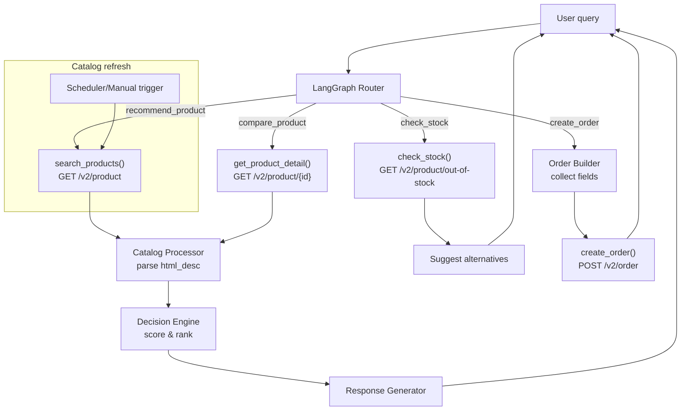

# BurgerPrintsAgent (BP1) - Tài liệu hướng dẫn (LangGraph)

## 1) Mục tiêu

Xây dựng AI Fulfillment Advisor giúp seller POD tìm, so sánh và lựa chọn SKU tối ưu dựa trên nhu cầu tự nhiên, không chỉ trả về catalog.

## 2) Endpoint BurgerPrints API v2 (thực sự có)

### Authentication

- GET /v2/authenticated

### Orders

- GET /v2/order
- GET /v2/order/{id}
- POST /v2/order
- GET /v2/order/tracking
- PUT /v2/order/cancel
- DELETE /v2/order
- POST /v2/order/charge
- POST /v2/order/webhook

### Product

- GET /v2/product
- GET /v2/product/{id}
- GET /v2/product/out-of-stock

### Balance

- GET /v2/balance

### Webhook

- POST /v2/webhook

## 3) Giá trị lớn nhất: html_desc

Product response có trường html_desc chứa thông tin quan trọng:

- Location
- Material
- Printing Method
- Processing (Lead Time)
- Special shipping rules (nếu có)

Ví dụ trích xuất:

- Gildan 5000: Material 100% cotton, Printing DTG, Location US, Processing 1-5 business days
- Gildan 64000: Location Poland, Processing 1-5 business days
- AOP Hoodie: Location China, Processing 5-10 business days, Printing hot-transfer

## 4) Brief vấn đề BP1

BurgerPrints có hàng trăm sản phẩm, nhiều khu vực sản xuất, nhiều công nghệ in, và thời gian fulfillment khác nhau. Seller phải đọc catalog, so sánh, và ra quyết định thủ công.

Mục tiêu là cho phép seller hỏi bằng ngôn ngữ tự nhiên, agent tự động tìm, so sánh, và đề xuất sản phẩm tối ưu.

## 5) Use case chính

### 5.1 Khám phá sản phẩm

User: "Tôi muốn bán áo thun cho thị trường Mỹ" Agent: đề xuất Gildan 5000 vì fulfillment US, DTG phổ biến, processing 1-5 ngày.

### 5.2 Tối ưu fulfillment

User: "Tôi muốn ship sang Đức nhanh nhất" Agent: ưu tiên sản phẩm location EU (Poland/Germany), lead time ngắn.

### 5.3 So sánh sản phẩm

User: "So sánh Gildan 5000 và Gildan 64000" Agent: đối chiếu location, material, lead time, market match.

### 5.4 Tư vấn seller

User: "Tôi mới bán POD. Nên bắt đầu với sản phẩm nào?" Agent: ưu tiên dễ bán, fulfillment nhanh, chi phí thấp.

### 5.5 Out of Stock Assistant

User: "Sản phẩm này còn hàng không?" Agent: gọi GET /v2/product/out-of-stock và đề xuất thay thế.

### 5.6 Tạo đơn hàng (Bonus)

User: "Tạo đơn hàng này giúp tôi" Agent: thu thập thông tin, gọi POST /v2/order.

## 6) Lý do dùng LangGraph (không cần Multi-Agent)

- BP1 có ít endpoint, luồng xử lý đơn giản, nhưng cần theo dõi trạng thái rõ ràng.
- LangGraph giúp chia nhỏ pipeline thành các node nhỏ, dễ debug, dễ mở rộng, và ổn định khi demo.
- Vẫn là một agent, nhưng có luồng điều hướng minh bạch (routing) thay vì nhiều agent độc lập.

## 7) Framework đề xuất (LangGraph)

### 7.1 Kiến trúc tổng thể (graph)



### 7.2 State trong LangGraph (đề xuất)

- query: câu hỏi người dùng
- intent: recommend_product | compare_product | check_stock | create_order
- products_raw: danh sách từ API
- products_norm: danh sách đã parse html_desc
- candidates: danh sách ứng viên theo lọc
- scores: điểm từng ứng viên
- winner: sản phẩm được chọn
- reasons: lý do chọn
- order_payload: dữ liệu tạo đơn (nếu có)
- response: câu trả lời cuối

### 7.3 Node trong graph (giải thích)

- Intent Node: phân loại intent và routing.
- Product Search Node: gọi GET /v2/product, lấy catalog.
- Product Detail Node: gọi GET /v2/product/{id} khi cần so sánh.
- Stock Check Node: gọi GET /v2/product/out-of-stock.
- Catalog Processor Node: parse html_desc -&gt; location, material, print_method, processing_time.
- Decision Engine Node: scoring theo rule và rank ứng viên.
- Compare Node: tạo bảng so sánh nếu intent là compare.
- Order Builder Node: hỏi thêm thông tin, tạo order_payload.
- Order Submit Node: gọi POST /v2/order.
- Response Generator Node: diễn giải kết quả rõ ràng, có lý do.

### 7.4 Intent detection (ví dụ)

- "Tôi muốn bán áo thun cho thị trường Mỹ" -&gt; recommend_product
- "So sánh G5000 và G64000" -&gt; compare_product
- "Sản phẩm này còn hàng không?" -&gt; check_stock
- "Tạo đơn hàng này" -&gt; create_order

## 8) Workflow xử lý (để implement)

1. Nhận query và chạy Intent Node
2. Router chọn nhánh trong graph
3. Gọi tool tương ứng (product/stock/order)
4. Parse html_desc và normalize
5. Chạy Decision Engine
6. Tạo phần giải thích và khuyến nghị
7. Trả lời và log kết quả

## 9) Decision Engine (minh họa)

Rule/score để chọn sản phẩm tối ưu, nhưng LLM chỉ tham gia ở bước phân tích và diễn giải.

### 9.1 Cách dùng LLM hợp lý

- LLM phân tích intent + tiêu chí: map yêu cầu sang trọng số và ưu tiên lọc. Ví dụ: "ship nhanh" -&gt; tăng trọng số fulfillment_time, ưu tiên location gần thị trường.
- Decision Engine tính điểm theo rule cố định để đảm bảo nhất quán.
- LLM giải thích kết quả theo dữ liệu đã tính.

### 9.2 Ví dụ score

$$ score = 0.4 \\cdot fulfillment_time + 0.3 \\cdot market_match + 0.2 \\cdot material + 0.1 \\cdot print_method $$

## 10) UI/UX (cụ thể hóa)

### 10.1 Màn hình chính (Chat + Card)

- Chat input ở dưới, có gợi ý prompt nhanh ("Ship EU nhanh nhất", "So sánh G5000 vs G64000").
- Kết quả hiển thị thành card sản phẩm: tên, short_code, location, processing time, print method.
- Có badge màu: "US", "EU", "FAST 1-5d", "DTG".

### 10.2 Giải thích quyết định

- Hiển thị lý do bằng bullet: địa điểm sản xuất, lead time, vật liệu.
- Nếu có so sánh, show bảng 2-3 cột (G5000 vs G64000).

### 10.3 Lọc và ưu tiên

- Bộ lọc nhanh: Location, Processing time, Print method.
- Slider cho lead time (1-5, 5-10, 10+).

### 10.4 Out-of-stock flow

- Nếu hết hàng, thông báo rõ: "Hết hàng".
- Đề xuất 2-3 sản phẩm thay thế tương đồng.

### 10.5 Tạo đơn hàng (bonus)

- Form đơn hàng dạng bước: tên khách, địa chỉ, SKU, số lượng.
- Xác nhận lại trước khi gọi API.

### 10.6 Trạng thái và lỗi

- Loading state: "Đang truy vấn catalog..."
- Error state: "Không lấy được dữ liệu, thử lại sau".
- Empty state: "Không tìm thấy sản phẩm phù hợp".

## 11) Endpoint tối thiểu để demo BP1

- GET /v2/product
- GET /v2/product/{id}
- GET /v2/product/out-of-stock
- POST /v2/order

## 12) Tech Stack & Thư viện triển khai

### 12.1 Backend / API

- **Framework:** FastAPI (nhẹ, hỗ trợ async tốt, tạo REST API nhanh gọn)
- **Server:** Uvicorn
- **HTTP Client:** `httpx` (để gọi API của BurgerPrints)

### 12.2 AI & Orchestration

- **LLM:** GPT-5.2-Codex (qua OpenAI API)
- **Agent Framework:** LangGraph (quản lý state, node, routing)
- **Thư viện AI:** `langchain-openai`, `langchain-core`

### 12.3 Data Processing

- **HTML Parsing:** `BeautifulSoup4` (bs4) để trích xuất thông tin từ `html_desc`
- **Validation:** `Pydantic` (định nghĩa schema cho LLM output, validation dữ liệu product)

### 12.4 Frontend (Tùy chọn)

- **ReactJS/NextJS**

## 13) Flow Code Triển khai (Pseudo-code)

### Bước 1: Định nghĩa Agent State

```python
from typing import TypedDict, List
from pydantic import BaseModel

class AgentState(TypedDict):
    query: str
    intent: str
    extracted_criteria: dict
    products_raw: List[dict]
    products_norm: List[dict]
    results: List[dict]
    response_msg: str
```

### Bước 2: Khởi tạo các Node chính

- **Node** `detect_intent`: Gọi LLM với Pydantic schema để lấy intent và trích xuất tiêu chí (location ưu tiên, max lead time).
- **Node** `fetch_catalog`: Dùng `httpx` gọi GET `/v2/product`.
- **Node** `process_catalog`: Dùng `bs4` cào `html_desc` lấy location, material, processing_time.
- **Node** `decision_engine`: Lặp qua danh sách đã parse, tính điểm dựa theo `extracted_criteria` từ state.
- **Node** `generate_response`: Gọi LLM giải thích kết quả dựa trên top product được chấm điểm.

### Bước 3: Định nghĩa Graph

```python
from langgraph.graph import StateGraph, END

workflow = StateGraph(AgentState)

# Add nodes
workflow.add_node("intent", detect_intent)
workflow.add_node("fetch", fetch_catalog)
workflow.add_node("process", process_catalog)
workflow.add_node("score", decision_engine)
workflow.add_node("respond", generate_response)

# Add edges
workflow.add_edge("intent", "fetch")
workflow.add_edge("fetch", "process")
workflow.add_edge("process", "score")
workflow.add_edge("score", "respond")
workflow.add_edge("respond", END)

workflow.set_entry_point("intent")
app = workflow.compile()
```

## 14) One-line summary

BurgerPrintsAgent là AI Fulfillment Advisor giúp seller POD tìm, so sánh, và chọn SKU tối ưu từ catalog BurgerPrints bằng ngôn ngữ tự nhiên, thay vì phải nghiên cứu thủ công.